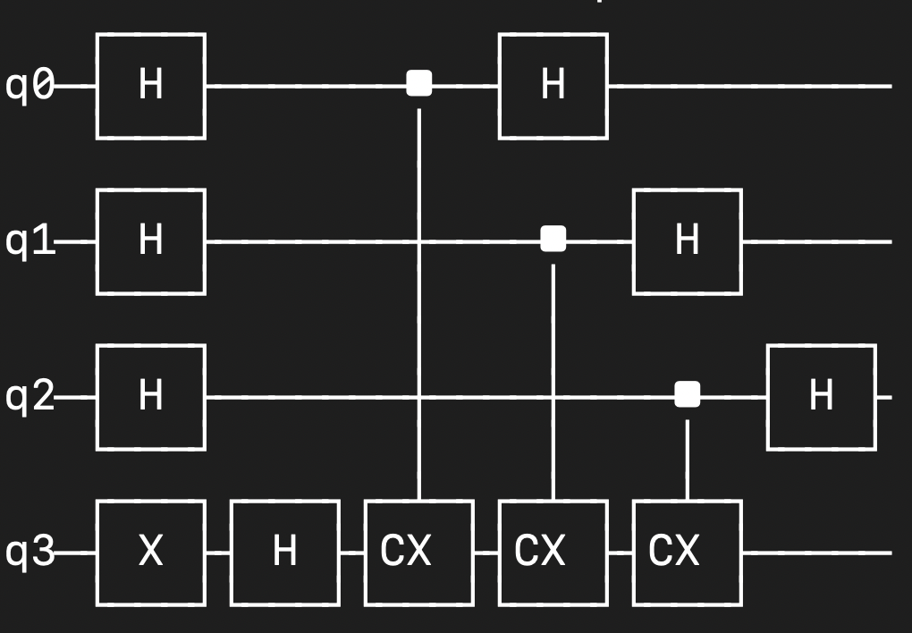
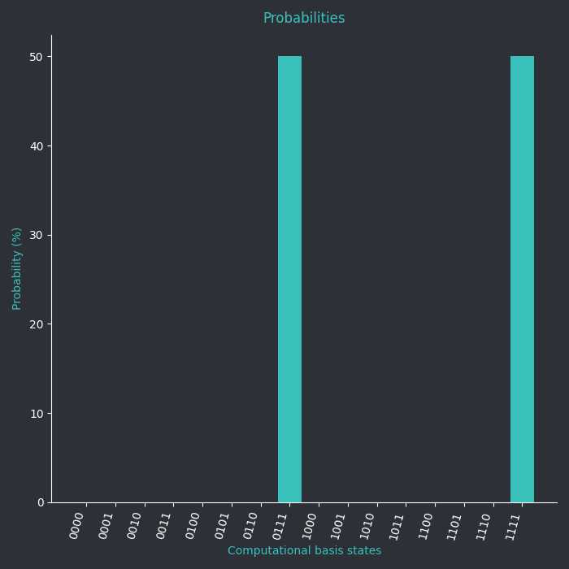

# Deutsch-Jozsa Algorithm

## Introduction
The **Deutsch-Jozsa algorithm** is a foundational quantum algorithm that determines whether a function `f: {0,1}^n → {0,1}` is **constant** (returns the same output for all inputs) or **balanced** (returns 0 for exactly half of all inputs and 1 for the other half). It does this exponentially faster than any classical algorithm.

In this tutorial, we'll implement the **Deutsch-Jozsa algorithm** using QCPY, modeled after the Qiskit approach.

---

## Step-by-Step Walkthrough

### Step 1: Imports and Setup
```python
from qcpy import quantumcircuit, visualize, measure
import random
```

### Step 2: Oracle Construction
#### Constant Oracle (always returns 0 or 1)
```python
def constant_oracle(qc, n, output_value=0):
    if output_value == 1:
        qc.x(n)  # Flip the output qubit to always return 1
```

#### Balanced Oracle (returns 0 for half inputs, 1 for others)
This version uses a CNOT from each input to the output, which ensures a balanced result:
```python
def balanced_oracle(qc, n):
    for i in range(n):
        qc.cx(i, n)  # Use each input qubit as a control for the output
```
**Why this works:** The CNOT gate flips the output qubit if the input qubit is 1. When we apply this operation from multiple input qubits, the output qubit flips an even or odd number of times depending on the number of 1s in the input. This effectively simulates a function that returns 1 for half of the inputs and 0 for the other half—making it a balanced function.

For example, with 3 input qubits, the function implemented returns 1 when an odd number of input qubits are 1. This creates an even distribution of outputs over all possible inputs.

---

### Step 3: Deutsch-Jozsa Circuit Builder
```python
def deutsch_jozsa(n=3, oracle_type="balanced"):
    total_qubits = n + 1
    qc = quantumcircuit(total_qubits)

    # Step 1: Initialize output qubit to |1⟩
    qc.x(n)

    # Step 2: Apply Hadamard to all qubits
    qc.h(range(total_qubits))

    # Step 3: Apply Oracle
    if oracle_type == "constant":
        constant_oracle(qc, n, output_value=0)  # or 1
    elif oracle_type == "balanced":
        balanced_oracle(qc, n)

    # Step 4: Apply Hadamard to input register (first n qubits)
    qc.h(range(n))

    # Step 5: Measure the circuit
    measure(qc)

    return qc
```

---

### Step 4: Run the Circuit
```python
qc = deutsch_jozsa(n=3, oracle_type="balanced")

print(qc)

measure(qc)

results = qc.state

print(results)

visualize.probability(qc, save=True)

visualize.qsphere(qc)
```

---

## Example Output
- **Printed circuit:** 

- **Probabiity:** 


## Expected Results
- If the result is all `0`s (e.g., `000`), then the function is **constant**.
- If the result is anything else (e.g., `101`, `110`, etc.), then the function is **balanced**.

---

## Why It Works
- **Constant Oracle**: Does not affect the phase of the quantum state. Hadamards revert the qubits back to |0⟩.
- **Balanced Oracle**: Introduces destructive interference. The output qubit’s flipping behavior (based on the input) changes the relative phases of the input superposition. After the second Hadamard transform, this interference guarantees that the all-zero result is never observed—revealing that the function is balanced.

---

## Summary
This algorithm uses quantum superposition and interference to drastically reduce the number of queries needed to classify black-box functions.

The Deutsch-Jozsa algorithm demonstrates the true potential of quantum speedup and serves as a foundation for more complex quantum algorithms.

---

