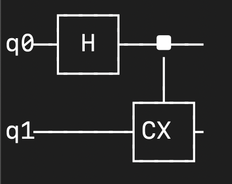
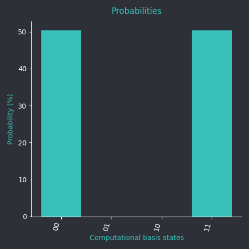
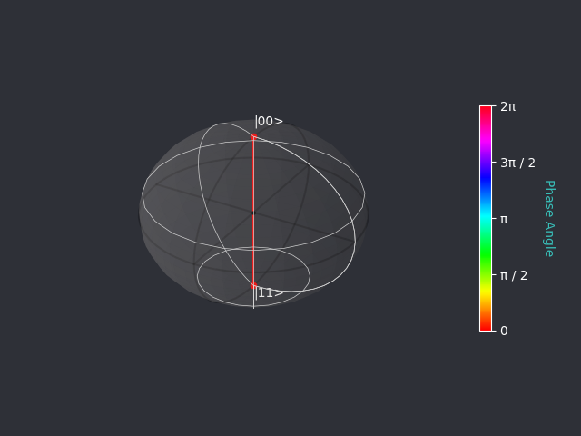

# Tutorial: Creating Your First Quantum Circuit

## Introduction
This tutorial walks you through setting up and running your first quantum circuit using QCPY. You will:
1. Create a 2-qubit quantum circuit.
2. Apply a Hadamard gate to the first qubit.
3. Apply a CNOT gate, using the first qubit as control and the second as target.
4. Display the circuit.
5. Measure the circuit.
6. Run program.
7. Show probability.
8. Show qsphere.

## Step 1: Setting Up Your Python File
Create a new Python file, e.g., `my_first_qc.py`, and start by importing the qcpy modules we need for building a circuit, measuring it, and visualizing it.

In terminal, use a text-editor of your choice, I'll be using vim:

```terminal
vim my_first_qc.py
```
In vim:

```python
from qcpy import quantumcircuit, visualize, measure
```

## Step 2: Creating a Quantum Circuit
Now, define a quantum circuit with 2 qubits:

```python
qc = quantumcircuit(qubits=2)
```

## Step 3: Applying Quantum Gates
First, apply a **Hadamard gate** to qubit 0 to create superposition:

```python
qc.h(0)  # Apply Hadamard gate to qubit 0
```

Next, apply a **CNOT (CX) gate** with qubit 0 as control and qubit 1 as target:

```python
qc.cx(0, 1)  # Apply CNOT gate
```

## Step 4: Display the circuit
To display your built circuit, just use the print function and pass the quantum circuit in as a parameter:

```python
print(qc)
```

Example output:


## Step 5: Measuring the Circuit
To obtain results, add a measurement step:

```python
measure(qc)
```

## Step 6: Running the Circuit
Finally, execute the quantum circuit and print the results:

```python
results = qc.state
print(results)
```

## State Vector
Running the script should output the state vector, showing a 50/50 probability of measuring `00` or `11` due to entanglement.

Example output:
```
[[0.70710677+0.j]
 [0.        +0.j]
 [0.        +0.j]
 [0.70710677+0.j]]
```

## Step 7: Show probability
To display the probability statistics, add:

```python
visualize.probability(qc) 
```

Example output:


This result can also be saved by adding the parameter ```save=True``` inside of the probability function:
```python
visualize.probability(qc, save=True)
```
It will save in the directory that you're running your program in.

## Step 8: Show qsphere
To display a 3d interactable qsphere, add:

```python
visualize.qsphere(qc)
```

Example output:


Similarly, this can also be saved (though only a .png and not the interactable qsphere) in the current directory:
```python
visualize.qsphere(qc, save=True)
```

Congratulations! 🎉 You've successfully created and executed your first quantum circuit using QCPY.

For more advanced tutorials, check out the [Usage Guide](usage.md).

Full tutorial code:
```python
from qcpy import quantumcircuit, visualize, measure

qc = quantumcircuit(qubits=2)

qc.h(0)

qc.cx(0, 1)

print(qc)

measure(qc)

results = qc.state

print(results)

visualize.probability(qc, save=True)

visualize.qsphere(qc)
```
